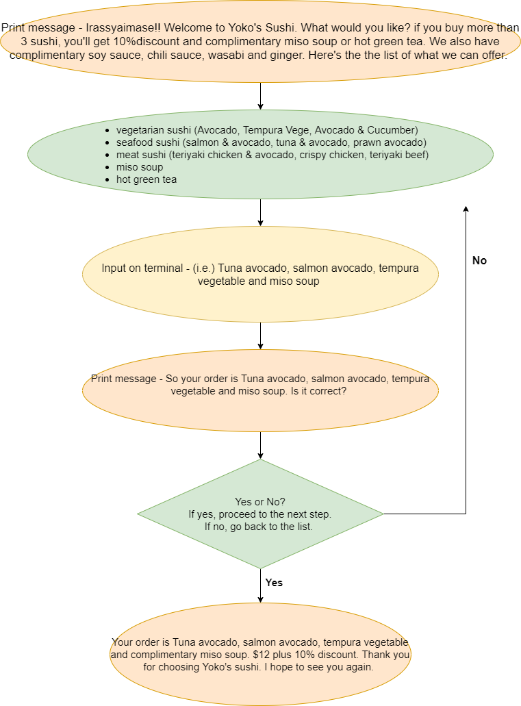
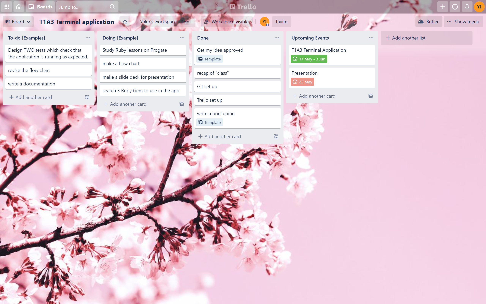
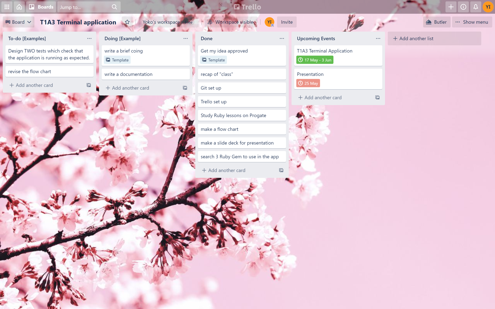
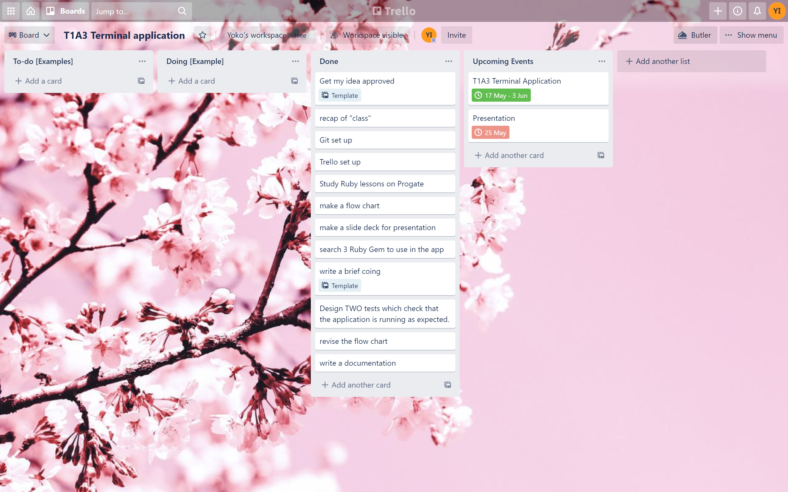

# Yoko Ujihara T1A3 Terminal Application "Yoko's Sushi Ordering App" 
------------------------------------------
## Purposes and scope
------------------------------------------
### Scope - what this app will do
This app will allow you to order sushi and show purchased items and final bills. It shows a welcoming message and asks you to input your name. Then, it lets you to choose sushi what you like by categories including vegetarian, seafood, meat and hot drinks. After you choose sushis you like, it shows a message to confirm your order. If it is your correct order, it proceeds to a check out and shows the total bills with your purchased items. If not, it asks you to choose the sushi items again.  

### Purposes and solutions 
This application is built in order to require the complete content of Coder Academy and solve the real-world problems I have been facing at work. This is the one of the required assignments to compelete Term 1. This is also made from my personal experience working in a sushi shop. I work at a Sushi shop as a sushi chef and sales representative. Through my work, I have encountered problems such as extra work though double handling because of staff shortage and difficulties in communication because of staff's limited English. It also allows to hire impared person and communicate with impared customers. This app also helps to reduce the risk of Covid-19 to minimise contact between staff and customers. 

### Target audience
I have three types of target audiences for this app. The first targeted audience is Sushi shop owers wanting to solve overworking due to staff shortage and increase sales. The second are employees who are not able to speak or hear, or are limited in their English. The third is the customers who is not able to speak or hear and bothered to talk in person in a hurry or who is too shay to talk to staff. This app ensures the community that the shop has installed compliance restrictions for Covid-19 such as social distancing and limitation of staff in and out of a kitchen.  

---------------------------------------
## Lists of features 

- **It allows you to order sushi by the categories**
There are 4 different categories which are vegetarian sushi , seafood sushi , meat sushi and hot dinks. Menu is as follows. Cutomers are given chances to confirm their orders and if the items are wrong, they are allow to choose again. 
    - Vegetarian sushi ($3.7) => Avocado, Tempura Vegetable, Avocado & Cucumber
    - Seafood sushi    ($4) => Salmon & Avocado, Tuna & Avocado, Prawn & Avocado
    - Meat sushi       ($4) => Teriyaki chicken & Avocado, Crispy chicken, Teriyaki beef
    - Hot drinks       ($2) => Miso soup, Green tea

- **It applis 10% discount and complimentary hot drinks when purchased more than 3 rolls**
There is a special discont and deal to customers who purchased more than 3 rolls. 10% discount and complimentary hot drinks are offered.  

- **It shows total bills with purchased items**
Total bill and purchased items are showen at the end of check out. It helps customers to reasure the order was correct. 

------------------------------------------------
## User interection and experience
1. Users are welcomed by a message and asked to input their names. Systems are explained briefly and the menu table is shown.

2. Users choose sushi's categories first, which are vegetarian, seafood, meat, and hot drinks. 
After categories are chosed, users choose items. Confirmation message is shown after items are chosen. If yes, proceed to the next categories or check out. If no, users are allowed to choose again. 

3. 10% discont or drink deal or the both apply, when they purchase more than 3 items depending on conditions. If they get more than 3 items which are only sushi, only 10% discount applies. If more than 3 items including sushi and hot drinks, one hot drink is free and 10% discount. 

4. Final bill is displayed with purchased items. How much users have saved because of the discount is also shown to make users feel great.    

--------------------------------------------
## Control flow

------------------------------------------------
## Implemantation plan
- Link to my trello
<https://trello.com/b/5QWirXJZ/t1a3-terminal-application>

- Early stage

- In progress

- Completed 

--------------------------------------------------
## Help documentation
1. Ruby must be installed on your computer. 
Please refer to [this page](https://www.ruby-lang.org/en/downloads/) for installation.
2. Make sure you clone this repository into your computer.
3. These Rubygems must be installed.
    
    - gem "artii", "~> 2.1"
    - gem "colorize", "~> 0.8.1"
    - gem "tty-prompt"
    - gem "tty-table"
4. Now, you are ready to use this app!
-------------------------------------------------
## Link to source control repository
<https://github.com/Yoko-cyer/Yoko-UJihara_T1A3>